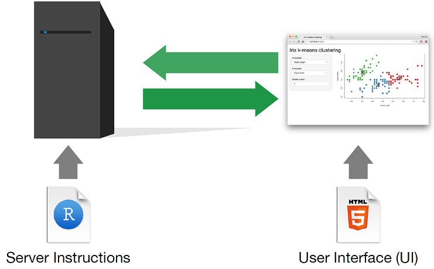
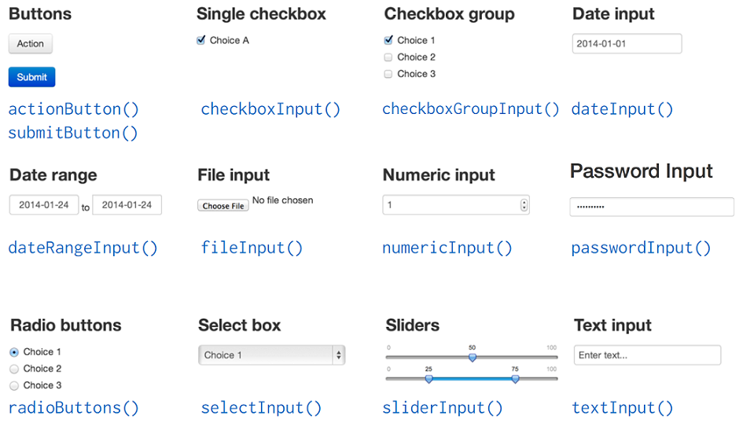
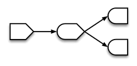
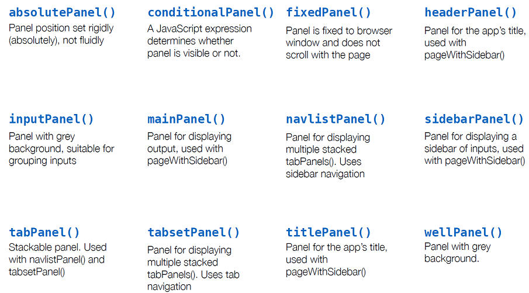

```{r setup, include=FALSE}
knitr::opts_chunk$set(echo = FALSE, warning=FALSE, error=FALSE, message = FALSE)
```

```{r, echo = FALSE}
library(knitcitations)
bib <- read.bibtex("References.bib")
```

# Einführung - Wie baue ich eine einfache Shiny Applikation

## App Architektur

Eine Shiny App besteht aus zwei Programmen: 

eines zur Definition der Benutzeroberfläche (`ui.r`) 

```{r chunck_01, eval=FALSE, echo=TRUE, results='hide'}
library(shiny)
# Define UI for application
ui <- fluidPage()
```

und ein zweites in dem die Analyse mit
R stattfindet (`server.r`) 

```{r chunck_02, eval=FALSE, echo=TRUE, results='hide'}
# Define server logic
server <- function(input, output) {}
# Run the application 
shinyApp(ui = ui, server = server)
```

## App Architektur



## Erstellung der Benutzeroberfläche

Elemente für die Benutzeroberfläche werden als Argumente der Funktion `fluidPage()` übergeben

```{r chunck_03, eval=FALSE, echo=TRUE, results='hide'}
# Define UI for application
ui <- fluidPage("Hello world")
```

Shiny generiert automatisch das *html* file zum Aufbau der Benutzeroberfläche:

```
<div class="container-fluid">Hello world</div>
```

## Ein- und Ausgabewerte einfügen

Elemente für die Applikation werden als Argumente der Funktion `fluidPage()` übergeben

```{r chunck_04, eval=FALSE, echo=TRUE, results='hide'}
# Define UI for application
ui <- fluidPage(
  # *Input() functions,
  # *Output() functions
)
```

# Inputs

## Inputs

Eingabewerte werden mit Hilfe der `*Input()` Funktion gebaut, z.B.

```{r chunck_05, eval=FALSE, echo=TRUE, results='markup'}
# Define UI for application
ui <- fluidPage(
  sliderInput(inputId = "num_slider_id",
              label = "Choose a number",
              value = 25, min = 1, max = 100)
)
```

```
<div class="form-group shiny-input-container">
  <label class="control-label" for="num_slider_id">Choose a number</label>
  <input class="js-range-slider" id="num_slider_id" data-min="1" data-max="100"
  data-from="25" data-step="1" data-grid="true" data-grid-num="9.9"
  data-grid-snap="false" data-keyboard="true" data-keyboard-step="1.01010101010101"
  data-drag-interval="true" data-data-type="number" data-prettify-separator=","/>
</div>
```

##



# Outputs

## Outputs

Ausgabewerte werden mit Hilfe der `*Output()` Funktion gebaut, z.B.

```{r chunck_06, eval=FALSE, echo=TRUE, results='markup'}
# Define UI for application
ui <- fluidPage(
  plotOutput(outputId = "plot_id",
             width = "100%", 
             height = "400px")
)
```

Das eigentliche plot Objekt wird in der Server Funktion generiert!

## Outputs

Funktion  | fügt ein:
------------- | -------------
dataTableOutput()  | interaktive Tabelle
htmlOutput()  | HTML
imageOutput() | Bild
plotOutput()  | Plot
tableOutput() | statische Tabelle
textOutput()  | Text
uiOutput()   | Shiny UI Elemment
verbatimTextOutput() | Text

# Erstellung des server.r Programms

## Erstellung des server.r Programms

Das `server.r` Programm beherbergt eine Funktion mit Anleitungen, wie die R-Objekte für die Benutzeroberfläche erstellt und aktualisiert werden sollen

```{r chunck_07, eval=FALSE, echo=TRUE, results='markup'}
# Define server logic
server <- function(input, output) {
  
}
```

Drei Regeln sind bei der Erstellung der `server` Funktion zu beachten:

1. Speichern der auszugebenen Objekte in `output$`
2. Erstellen der auszugebenen Objekte mit der `render*()` Funktion
3. Ansteuern von Eingabewerten mit Hilfe von `input$`

## Auszugebene Objekte werden in `output$` gespeichert {.smaller}

```{r chunck_08, eval=FALSE, echo=TRUE, results='markup'}
library(shiny)
# Define UI for application
ui <- fluidPage(
  "Iris data set",
  plotOutput(outputId = "iris_scatterplot")
)
# Define server logic
server <- function(input, output) {
  
  output$iris_scatterplot <- # some code ...
  })
}
# Run the application 
shinyApp(ui = ui, server = server)
```

## Erstellen der auszugebenen Objekte mit der `render*()` Funktion {.smaller}

```{r chunck_09, eval=FALSE, echo=TRUE, results='markup'}
library(shiny)
library(ggplot2)
# Define UI for application
ui <- fluidPage(
  "Iris data set",
  plotOutput(outputId = "iris_scatterplot")
)
# Define server logic
server <- function(input, output) {
  output$iris_scatterplot <- renderPlot({
    p <- ggplot(data = iris, aes(x = Sepal.Length, y = Sepal.Width))
    p + geom_point(aes(color = Species))
  })
}
# Run the application 
shinyApp(ui = ui, server = server)
```

## Erstellen der auszugebenen Objekte mit der `render*()` Funktion {.smaller}

Man wähle eine `render*()` Funktion, welche den gewünschten Output-Typ erstellt

Funktion  | erstellt:
------------- | -------------
renderDataTable()  | interaktive Tabelle
renderImage()  | Bild (als Link zu einem source file)
renderPlot() | Plot
renderPrint()| Codeblock aus geprintetem output
renderTable() | statische Tabelle
renderText() | charcter string
renderUI()   | Shiny UI Element

innerhalb der `render*()` Funktion befindet sich der Code zur Erstellung des Objektes


## Eingabewerten werden mit `input$` angesteuert {.smaller}

```{r chunck_10, eval=FALSE, echo=TRUE, results='markup'}
library(shiny)
library(ggplot2)
# Define UI for application
ui <- fluidPage(
  "Iris data set",
  selectInput(inputId = "input_x_variable", 
              label = "X Variable", 
              choices = colnames(iris), 
              selected = colnames(iris)[1]),
  selectInput(inputId = "input_y_variable", 
              label = "Y Variable", 
              choices = colnames(iris), 
              selected = colnames(iris)[2]),
  plotOutput(outputId = "iris_scatterplot")
)
# Define server logic
server <- function(input, output) {
  output$iris_scatterplot <- renderPlot({
    p <- ggplot(data = iris, aes_string(x = input$input_x_variable,       
                                        y = input$input_y_variable))
    p + geom_point(aes(color = Species))
  })
}
# Run the application 
shinyApp(ui = ui, server = server)
```

# Beispiele

## Externe Datensätze hochladen {.smaller}

```{r chunck_11, eval=FALSE, echo=TRUE, results='markup'}
library(shiny)
library(ggplot2)
library(data.table)
#write.csv(iris, "iris.csv", row.names = FALSE)
#Define UI for application
ui <- fluidPage(
  "Externe Datensätze hochladen",
  # Copy the line below to make a file upload manager
  fileInput(inputId = "upload_file_id", label = "File input"),
  #define a text output that displays the return of fileInput() function
  verbatimTextOutput(outputId = "output_text_id"),
  #define an interactive table of the uploaded data set
  dataTableOutput(outputId = "output_table_id")
)
# Define server logic
server <- function(input, output) {
  # You can access the value of the fileInput() function with input$output_text_id
  output$output_text_id <- renderPrint({
    str(input$upload_file_id)
  })
  output$output_table_id <- renderDataTable({
    if(is.null(input$upload_file_id)){return(NULL)}else{
      uploaded_data <- fread(input$upload_file_id[1, 4])}
  }, options = list(lengthChange = TRUE))
}
# Run the application 
shinyApp(ui = ui, server = server)
```

## Dateien (Tabellen, Grafiken) herunterladen {.smaller}

```{r chunck_12, eval=FALSE, echo=TRUE, results='markup'}
library(shiny)
# Define UI for application
ui <- fluidPage(
  "Hello world",
  selectInput(inputId = "select_data", 
              label = "Select data set", 
              choices = data(package = "datasets")$results[,3]),
  dataTableOutput(outputId = "table_id"),
  downloadButton(outputId = "download_id")
  )
# Define server logic
server <- function(input, output) {
  output$table_id <- renderDataTable({
    as.data.frame(get(input$select_data))
  })
  
  output$download_id <- downloadHandler(
    filename = function(){ 
      paste(input$select_data, '.csv', sep='') 
    },
    content = function(file){
      write.csv(as.data.frame(get(input$select_data)), file)
    }
  )
}
# Run the application 
shinyApp(ui = ui, server = server)
```

## Dateien (Tabellen, Grafiken) herunterladen {.smaller}

```{r chunck_12b, eval=FALSE, echo=TRUE, results='markup'}
library(shiny)
# Define UI for application
ui <- fluidPage(
  "Hello world",
  selectInput(inputId = "select_data", 
              label = "Select data set", 
              choices = data(package = "datasets")$results[,3]),
  plotOutput(outputId = "download_plot_id"),
  downloadButton(outputId = "download_id")
  )
# Define server logic
server <- function(input, output) {
  output$plot_id <- renderPlot({
    data_tmp <- as.data.frame(get(input$select_data))
    if(ncol(data_tmp) < 2){
      return(NULL)
    }else{
      plot(data_tmp[,1:2])
    }
  })
  output$download_plot_id <- downloadHandler(
    
    filename = function(){ 
      paste(input$select_data, '.pdf', sep='') 
    },
    
    content = function(file){
      pdf(file)
      plot(as.data.frame(get(input$select_data))[,1:2])
      dev.off()
    })
  }
# Run the application 
shinyApp(ui = ui, server = server)
```


# Wie baue ich reaktive Umgebungen

## Was ist Reaktivität?

Shiny Applikationen beruhen weitestgehend auf die Zurverfügungstellung von *input* Werten, Bereitstellung dieser in *R* und Rücksendung der evaluierten R Objekte als *output* zur Webseite.

```
input values => R Code => output values
```

## Was ist Reaktivität?

Shiny verfügt über drei reaktive Programmierobjekte:

* reactive source (**Reactive values**) - *input* Objekt (slider, text, numeric)
* reactive conductor (**Reactive expressions**) - `reactive()` Funktion
* reactive endpoint (**Observers**) - *output* Objekt (plot, table)



Ein *input* Objekt kann mit mehreren *output* Objekten verbunden sein und umgekehrt.

##

Die Auswertugsroutine einzelner Funktionen wird durch den Ort ihrer Definition in der `server` Funktion bestimmt:


```{r chunck_13, eval=FALSE, echo=TRUE, results='markup'} 
library(shiny)

1. some code ... run once when app is launched

# Define UI for application
ui <- fluidPage("Hello world")
# Define server logic
server <- function(input, output) {
  
  2. some code ... run once each time a user visits the app
  
  output$* <- render*({
    
    3. some code ... run each time a user changes a widget that output$* relies on
    
  })
}
shinyApp(ui = ui, server = server)
```


# Die Benutzeroberfläche definieren

## Einbinden statischer Elemente {.smaller}

Innerhalb der `fluidPage()` Funktion kann statischer *html* Code eingebunden werden

```{r chunck_14, eval=FALSE, echo=TRUE, results='markup'} 
library(shiny)
# Define UI for application
ui <- fluidPage(
  
  HTML("
    <h1>Ein Beispiel für Header</h1>
    <p>Ein Beispiel für Paragraph</p>
    ")

)
# Define server logic
server <- function(input, output) {}
shinyApp(ui = ui, server = server)
```

## Einbinden statischer Elemente {.smaller}

R shiny verfügt über eine große Banbreite von vordefinierten *HTML Builder Functions*

```{r chunck_15, eval=FALSE, echo=TRUE, results='markup'} 
library(shiny)
# Define UI for application
ui <- fluidPage(
  #use tags
  tags$p("Dies ist eine Beispiel", 
         tags$a(href = "https://shiny.rstudio.com/", "Shiny"), 
         "App."),
  #use simple functions for constructing HTML documents
  p("Es ist einfach GUI mit", 
    a(href = "https://cran.r-project.org/", "R"),
    code("Code"),
    em("zu"),
    strong("erstellen")) 
)
# Define server logic
server <- function(input, output) {}
shinyApp(ui = ui, server = server)
```

## Häufig verwendete *tags* Funktionen {.smaller}

Funktion  | erstellt:
------------- | -------------
a()  | Hyperlink
br()  | Zeilenumbruch
code()| Formatiert Text wie Computercode
em()  | kursiv
h1(), h2(), ... | Überschriften
hr()  | horizontale Linie
img() | Bild
p()   | Paragraf
strong()| fett

Siehe auch [Shiny HTML Tags Glossary](https://shiny.rstudio.com/articles/tag-glossary.html)

## Organisation der *UI* Elemente {.smaller}

Vordefinierte [Layout Funktionen](http://shiny.rstudio.com/articles/layout-guide.html) ermöglichen die Organisation der *UI* Elemente. Wir verwenden Panels um Gruppen von *UI* Elementen zu bilden.

```{r chunck_16, eval=FALSE, echo=TRUE, results='markup'}
library(shiny)
# Define UI for application
ui <- fluidPage(
  titlePanel(title = "Example App"),
  sidebarLayout(
    sidebarPanel(
      *Input(),
      *Input(),
      downloadButton()
      ),
    mainPanel(
      *Output(),
      *Output()
    )
  )
)
# Define server logic
server <- function(input, output) {}
# Run the application 
shinyApp(ui = ui, server = server)
```


##



## Organisation der *UI* Elemente {.smaller}

Die *UI* Elemente können in unterschiedlichen Tabs mit der Funktion `tabPanel()` definiert werden:

```{r chunck_17, eval=FALSE, echo=TRUE, results='markup'}
library(shiny)
# Define UI for application
ui <- fluidPage(
  titlePanel(title = "Example App"),
  sidebarLayout(
    sidebarPanel(
      *Input(),
      *Input(),
      downloadButton()
      ),
    mainPanel(
      tabsetpanel(
        tabPanel(
          *Output()
        ),
        tabPanel(
          *Output()
        )
      )
    )
  )
)
# Define server logic
server <- function(input, output) {}
# Run the application 
shinyApp(ui = ui, server = server)
```

## Organisation der *UI* Elemente {.smaller}

Eine Erweiterung zu den standard Shiny-Layoutimplementierungen bietet das Paket `shinydashboard` an:

```{r chunck_18, eval=FALSE, echo=TRUE, results='markup'}
library(shiny)
library(shinydashboard)

ui <- dashboardPage(
  dashboardHeader(),
  dashboardSidebar(),
  dashboardBody()
)

server <- function(input, output) { }

shinyApp(ui, server)
```

# Interaktive Grafiken einbinden

## Interaktive Grafiken einbinden

Interaktive Grafiken ermöglichen es zusätzliche Information zu Datenpunkten zur Verfügung zu stellen (mouse hover), Datenpunkte zu selektieren, oder Hyperlinks an Datenpunkte zu binden.

Es stehen mehrere Ebenen zur Implementierung interaktiver Grafiken zur Verfügung:

* Shinys eingebaute Funktionalität für R Standardplots (`plot()`) und  [ggplot2](http://ggplot2.org/)
* [htmlwidgets](http://www.htmlwidgets.org/) JavaScript Visualisierungsbibliotheken
* [crosstalk](http://rstudio.github.io/crosstalk/) ermöglicht die Verbindung mehrerer *htmlwidgets*

## Einbinden von *htmlwidgets* {.smaller}

```{r chunck_19, eval=FALSE, echo=TRUE, results='markup'}
library(shiny)
library(plotly)
# Define UI for application
ui <- fluidPage(
  "Iris data set",
  selectInput(inputId = "input_x_variable", 
              label = "X Variable", 
              choices = colnames(iris), 
              selected = colnames(iris)[1], 
              multiple = FALSE),
  selectInput(inputId = "input_y_variable", 
              label = "Y Variable", 
              choices = colnames(iris), 
              selected = colnames(iris)[2], 
              multiple = FALSE),
  plotlyOutput(outputId = "iris_scatterplot")
)
# Define server logic
server <- function(input, output) {
   output$iris_scatterplot <- renderPlotly({
    p <- ggplot(data = iris, aes_string(x = input$input_x_variable,
                                        y = input$input_y_variable))
    p + geom_point(aes(color = Species))
  })
}
# Run the application 
shinyApp(ui = ui, server = server)
```

## Interaktive Plots mit basic plots und ggplot2 {.smaller}

Innerhalb der `renderPlot()` Funktion können folgende Argumente *mouse-based* Interaktionen zur Verfügung stellen:

Argument  | Aktion
------------- | -------------
`click = "mouse_event_id"`  | Plot sendet Koordinaten zum Server bei einfachem Mausklick
`dblclick  = "mouse_event_id"` | Plot sendet Koordinaten zum Server bei doppeltem Mausklick
`hover  = "mouse_event_id"` | Plot sendet Koordinaten zum Server bei Maushover
`brush = "mouse_event_id"` | Plot sendet Koordinaten des gezeichneten Rechteckes (`xmin`, `xmax`, `ymin`, and `ymax`) an Server

Die Koordinaten werden an den Server über `input$mouse_event_id` übergeben.

## Interaktive Plots mit basic plots und ggplot2 {.smaller}

```{r chunck_20, eval=FALSE, echo=TRUE, results='markup'}
library(shiny)
library(plotly)
# Define UI for application
ui <- fluidPage(
  "Iris data set",
  selectInput(inputId = "input_x_variable", 
              label = "X Variable", 
              choices = colnames(iris), 
              selected = colnames(iris)[1], 
              multiple = FALSE),
  selectInput(inputId = "input_y_variable", 
              label = "Y Variable", 
              choices = colnames(iris), 
              selected = colnames(iris)[2], 
              multiple = FALSE),
  plotOutput(outputId = "iris_scatterplot",
             click = "plot_click"),
  verbatimTextOutput("info_plot")
)
# Define server logic
server <- function(input, output) {
   output$iris_scatterplot <- renderPlotly({
    p <- ggplot(data = iris, aes_string(x = input$input_x_variable,
                                        y = input$input_y_variable))
    p + geom_point(aes(color = Species))
    })
   
    output$info_plot <- renderText({
      paste0("x=", input$plot_click$x, "\ny=", input$plot_click$y)
      })
}
# Run the application 
shinyApp(ui = ui, server = server)
```

# Bereitstellung der Shiny Applikation

## Bereitstellung der Shiny Applikation {.smaller}

Es bestehen mehrere Möglichkeiten Shiny Apps zur Verfügung zu stellen:

* [shinyapps.io](https://www.shinyapps.io/) - Dienstleistungsplattform um Shiny Apps zu verwalten und speichern
* [Shiny server](https://www.rstudio.com/products/shiny/shiny-server/) - Aufbau eines Webservers zur internen und externen Publikation
* [lokal](https://shiny.rstudio.com/articles/deployment-local.html)
* [als Funktion](https://shiny.rstudio.com/articles/function.html):


```{r chunck_21, eval=FALSE, echo=TRUE, results='markup'}
beispiel_funktion <- function(var) {
  require(shiny)
  shinyApp(
    ui = fluidPage(plotOutput("hist")),
    server = function(input, output) {
      output$hist <- renderPlot( 
        hist(var, col = "skyblue", border = "white") 
      )
    })
}
beispiel_funktion(faithful$eruptions)
```


# Erweiterungen

## Erweiterungen

Diverse Pakete zur Erweiterung der shiny Grundfunktionalität stehen zur Verfügung:

[shinydashboard](http://rstudio.github.io/shinydashboard/) - Dashboard Layout
[Shiny Themes](http://rstudio.github.io/shinythemes/) - CSS themes
[shinyjs](https://github.com/daattali/shinyjs/blob/master/README.md) - JavaScript actions
[htmlwidgets](http://www.htmlwidgets.org/) - JavaScript Datenvisualisierungstools

Weiterhin besteht die Möglichkeit:

* Shiny Apps in [R Markdown](http://rmarkdown.rstudio.com/) Dokumente einzubinden, wie z.B.
    + *ioslides* Präsentation
    + *html* Dukumentation

## References

* Chang, Winston, Joe Cheng, JJ Allaire, Yihui Xie, and Jonathan
McPherson. 2016. Shiny: Web Application Framework
for R. https://CRAN.R-project.org/package=shiny.

* R Core Team. 2016. R: A Language and Environment for Statistical
Computing. Vienna, Austria: R Foundation for
Statistical Computing. https://www.R-project.org/.

* http://shiny.rstudio.com/ 